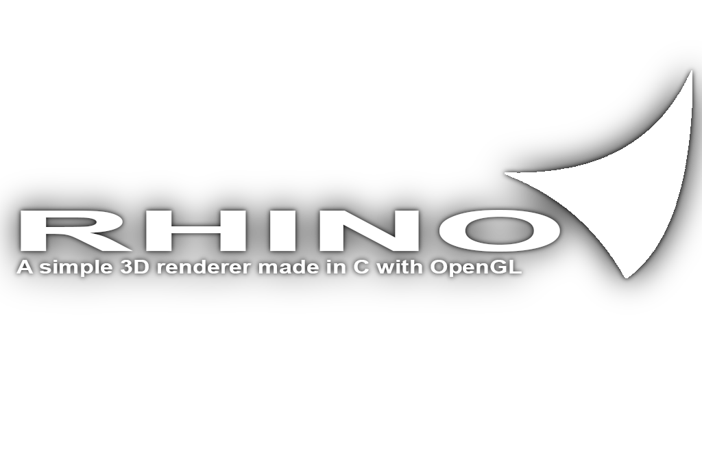

# Rhino Framework

Rhino is a simple 3D renderer written from the ground up in C using the OpenGL rendering API as its backend, written in just under a week. The renderer showcases the core components of modern 3D rendering using the OpenGL 3.3 Core API to implement 3D projection, texturing, lighting and more.

# Features 

- 📦 - Working 3D projection, 3D standard projection x view x model matrix
- 🎆 - Shader effects to achieve lighting, texture sampling and more
- 🎨 - Textures, binding to multiple texture units and rendering to multiple objects at once with various effects
- ⌨ - Input handling, 3D FPS-style camera in the available demo
- 💡 - Point lighting system

# Backstory

I've desired to take a significant plunge into graphics programming for a while now. My previous project "ZombieGuy40" touched upon graphics/engine dev in a 2D space, however Rhino is my first attempt at making a 3D renderer from scratch in C.

I knew in order to enter the field of games that I so desired (graphics programming), I'd need to study math and GPU architecture concepts extensively, and for the independant research project of my college games course, I decided this would be the perfect time to do so and get some practical nitty gritty graphics programming done with OpenGL to venture into more advanced territory.

# Development

The development of the Rhino renderer was a unique challenge for me. A significant chunk of developing Rhino was merely reading up on linear algebra concepts (e.g matrices, matrix-matrix multiplication, 4x4 matrices) and more advanced trigonometry, however there was also a handful of unique technical lessons learnt in terms of practical execution. These are as follows :

- Working with bindings and the OpenGL state, understanding VAOs + objects & targets
- Creating a text file parser from scratch in C to load my vertex & fragment shaders
- Learning how to apply learnt math concepts with the CGLM math library

Having gotten Rhino finished I now understand the standard 3D real-time rendering pipeline and got to successfully implement one in C.

I learnt many things developing Rhino. 

- I got to experiment with vertex & fragment shaders and how to pass data from the CPU over to a shader program on the GPU via vertex attributes & uniforms
- I learnt how to implement a standard render loop of clearing color and depth buffers > applying uniforms > binding VAOs and then drawing elements
- I used the GLFW windowing & context management library to create a window & context, poll for input and to get important information for real-time rendering such as delta-time for operations independant of frame-rate

# Breakdown

Rhino is very minimal, broken into a small handful of C files it handles and automates some functionality for you and leaves you to build upon that foundation to render graphics.

- main.c - handles window creation, loading of OpenGL functions and the calling of the core render-loop.
- shaders.c - provides functionality for parsing, compiling and linking shader files into a returnable shader program object ID for you to use.
- textures.c - provides the load_texture() function, allowing you to specify a texture path and texture unit of which it will then handle the loading and binding of which for you.
- rhino_callbacks.c - provides callbacks such as program init, exit and various loops
- rhino_global.h - provides camera, mouse and information about the window to use all across the progarm

# Libraries

Rhino only uses a handful of low-level libraries :

- GLFW (windowing and context management)

- GLAD (loading OpenGL function pointers)

- stb_image.h (image parsing)

- CGLM (C port of the OpenGL Math library)

# Building

Windows (MSYS2 + GCC + Make) :

- clone repo
- ensure GLFW library is downloaded and in your includes
- run "make"

Linux (GCC + Make) :
- should be the same, you will need to change the bound libraries in the Makefile to that of the relevant Linux libraries though, if I can find these I'll include them in an ifdef
- might need to remove -mwindows flag as it might be exclusive to compiling windows binaries
